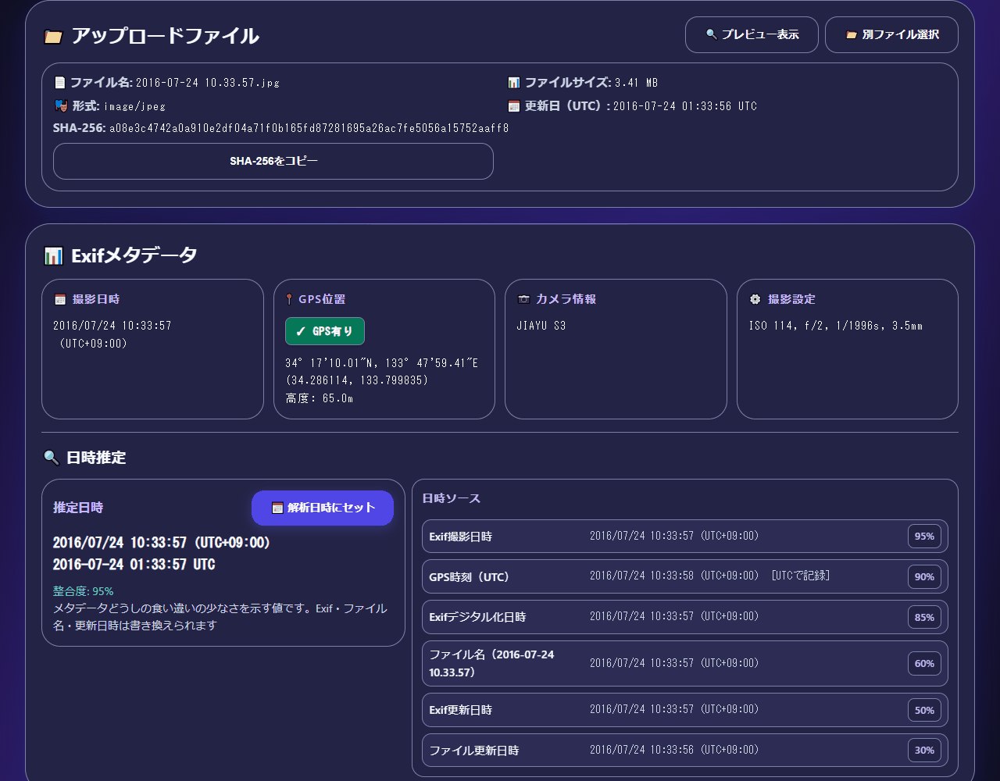
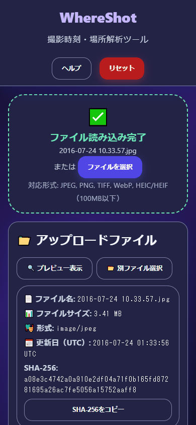

# WhereShot - Capture Time & Place Analyzer

English · [日本語](README.md)


[](https://ipusiron.github.io/whereshot/)

**Day013 - Security Tools 100 with Generative AI**

WhereShot is an OSINT helper for estimating and verifying when and where a photo was taken.
It combines Exif extraction, sun position calculation, bearing on a map, and links to weather records and satellite imagery.
Photos without Exif can still be examined by filling in the time and the location by hand.

## 🌐 Demo

👉 [Open WhereShot](https://ipusiron.github.io/whereshot/)

## 📸 Screenshots


> *Exif, SHA-256 and a 95% consistency estimate for the Marugame Castle sample*


> *The browser runs in America/Los_Angeles. UTC+09:00 is inferred from GPS, and the sun altitude reads 64.0°*


> *The sample loaded at a viewport width of 390px*

## ✨ Features

### 📊 Metadata analysis

- ExifReader extracts the capture time, GPS coordinates, camera settings and lens information
- The basis of the UTC offset and the consistency of the date sources are shown
- The file SHA-256 and the analysis report can be copied

### 🌐 Japanese and English

- One header button switches the whole interface, the notifications and the analysis report
- The language is taken from `?lang=ja` / `?lang=en`, then the saved choice, then the browser
- Compass points, times of day and source names are re-translated without losing the results

### 🗺️ Geospatial view

- **Interactive map**: rendered with Leaflet
- **Multiple layers**: OpenStreetMap, satellite imagery and terrain

### 🌞 Solar geometry

- **Sun position**: computed with the bundled SunCalc
- **Shadow analysis**: the shadow length and direction follow from the altitude and azimuth
- **Time checking**: compare the shadows in the photo with the computed ones

### 🧭 Bearing

- **Direction arrows**: the bearing recorded in Exif, and a direction picked by hand on the map

### 🌐 External data

Links are generated for you so that the follow-up work is quick.

- **[NASA Worldview](https://worldview.earthdata.nasa.gov/)**: satellite imagery and weather layers
- **[GSI Maps](https://maps.gsi.go.jp/)**: aerial photos and topographic maps of Japan
- [JMA past weather](https://www.data.jma.go.jp/stats/etrn/index.php): hourly records of the nearest station

The nearest of 54 stations is chosen; when none lies within 200km the link points at the JMA top page instead.
Outside Japan, and for Ogasawara, Amami, Hachijojima and Daito, no station is available.

## 📖 How to use

1. Open the [demo page](https://ipusiron.github.io/whereshot/), or open index.html directly.
2. Drag and drop an image, then read the Exif tags and the time estimate.
3. Check the UTC offset and the analysis time, and change them if needed.
4. Look at the capture point on the map. Without GPS, the manual location mode turns on, so click the map.
5. Check the sun position and the shadows, and study the surroundings through the external links.
6. Copy the SHA-256 and the analysis result if you need them.

"Set the location by hand" and "Set the camera direction" are never active at the same time.
With both off, clicking the map does not move the marker.
The preview can be shown and hidden with its button.

### Worked example

These are the results for the [Marugame Castle sample](assets/2016-07-24%2010.33.57.jpg).

| Item | Value |
|---|---|
| Capture time (local) | 2016/07/24 10:33:57 |
| Capture time (UTC) | 2016-07-24 01:33:57 UTC |
| UTC offset | +09:00 (gap with the GPS time, residual -1 s) |
| Sun altitude | 64.0° |
| Sun azimuth | 117.3° (ESE) |
| Shadow direction | 297.3° (WNW) |
| Shadow length | 0.49× the height |
| Consistency | 95% |
| Nearest station | 高松 / Takamatsu (about 23 km) |
| SHA-256 | a08e3c4742a0a910e2df04a71f0b165fd87281695a26ac7fe5056a15752aaff8 |

## 🕒 Time and time zones

An Exif capture time is the local time at the site, and DateTimeOriginal carries no time zone of its own.
The "wall clock" of year, month, day, hour, minute and second is combined with a UTC offset to reach a UTC instant.
A camera clock is not necessarily set to the local time; a traveller's camera needs checking.

Candidates for the UTC offset are taken in this order, and the basis is shown on screen.

1. The Exif OffsetTimeOriginal
2. The gap between the local time and the GPS time in UTC, rounded to 15 minutes (rejected when the residual exceeds 5 minutes)
3. The browser time zone for that date, as a provisional value

For the sample, local 10:33:57 against GPS 01:33:58 UTC yields UTC+09:00 with a residual of -1 second.
A disagreement between the Exif offset and the GPS estimate raises a warning.
The offset can be changed by hand, and the analysis time keeps its seconds.

The hint derived from the longitude is only displayed, never applied on its own; it may differ from standard time or daylight saving.

## 🗂️ Supported formats and file names

### Supported formats

| Format | MIME |
|---|---|
| JPEG | image/jpeg |
| PNG | image/png |
| TIFF | image/tiff |
| WebP | image/webp |
| HEIC/HEIF | image/heic, image/heif |

The limit is 100MB. Video, such as MP4, is out of scope.
When the browser cannot render HEIC/HEIF, the preview is skipped and the metadata analysis continues.
For damaged content, or a file with no Exif, a notice says that the metadata could not be read.

### File name formats

| Example | Pattern | Date read | Reference |
|---|---|---|---|
| IMG_20240101_123456.jpg | ymd-hms-compact | 2024/01/01 12:34:56 | local |
| PXL_20240101_123456789.jpg | pxl-utc | 2024-01-01 12:34:56 UTC | UTC |
| Screenshot_2024-01-01-12-34-56.png | ymd-hms-sep | 2024/01/01 12:34:56 | local |
| signal-2024-01-01-123456.jpg | ymd-sep-hms-compact | 2024/01/01 12:34:56 | local |
| WhatsApp Image 2024-01-01 at 12.34.56.jpeg | ymd-hms-sep | 2024/01/01 12:34:56 | local |
| 20160724103357.jpg | ymdhms-14 | 2016/07/24 10:33:57 | local |
| 2024年1月1日12時34分56秒.jpg | ja-full | 2024/01/01 12:34:56 | local |
| IMG-20240101-WA0001.jpg | ymd-8 | 2024/01/01 12:00:00 | local, date only |
| 1609459200.jpg | unix-s | 2021-01-01 00:00:00 UTC | UTC |

Eleven patterns are tried from the strongest down, and an accepted span of characters is never read twice.
The 12:00:00 used for a date-only name is a placeholder, not a capture time.
An invalid calendar date is rejected rather than rolled into the next month.

## 🎯 Use cases

### Ways of using this tool in particular

- Finding a height from the length of a shadow (science and math classes): for the Marugame Castle sample image (10:33 on 24 July 2016), the sun is at 64.0° and the shadow length shows as "0.49× the height". Measure a shadow and divide by 0.49 to get the height; a 1.5 m shadow means about 3.1 m. Set the location and the analysis time to your schoolyard and the class time to get the ratio there. It is a real-world example of the tangent (only on flat ground with a clear shadow tip)
- Comparing sunlight across the seasons (house hunting and gardening): set the location by hand and change only the analysis time to compare the sun's altitude. At noon (UTC+09:00) at 35.68°N, 139.77°E (near Tokyo Station), 22 December 2026 (winter solstice) gives 30.7° with a shadow 1.69 times the height, and 21 June (summer solstice) gives 77.2° and 0.23 times. A 10 m building to the south casts a shadow of about 17 m at noon on the winter solstice (terrain and the shapes of nearby buildings are not taken into account)
- Finding a camera clock left on home time in travel photos (organizing photos): for photos with a GPS time, the tool infers the UTC offset from the difference between the capture time and the GPS time (UTC). If a photo taken in Bangkok has a capture time of 14:00:00 and a GPS time of 05:00:02 UTC, the inferred offset is UTC+09:00 (residual -2 seconds). Bangkok's standard time is UTC+07:00, so the camera clock was still on Japan time, which tells you how to fix the times in the album (smartphones set their clocks automatically, so this is less likely with them)

### OSINT and verification

- **Checking social posts**: whether the claimed time and place hold together
- **Spotting recycled photos**: finding the earlier use of an image
- **Reviewing evidence**: judging how much weight an image can carry

### Incidents and disasters

- **Reading the scene**: clues to the place and the time in photos from a disaster area
- **Newsroom checks**: whether the photo matches the reported situation
- **Building a timeline**: working through images one at a time

### Teaching and training

- **Learning OSINT**: hands-on practice with open sources
- **Media literacy**: judging whether a digital image is what it claims to be
- **Security awareness**: understanding the risk carried by metadata

## 🔬 How it is built

| Part | Implementation |
|---|---|
| Interface | vanilla JavaScript, HTML, CSS |
| Exif | ExifReader 4.12.0 (self-hosted) |
| Sun position | SunCalc 1.9.0 (self-hosted) |
| Map | Leaflet 1.9.4 (CDN with SRI), three tile sets |
| Pure logic | js/whereshot-logic.js (no DOM, no time zone, no wording) |
| Wording | js/i18n.js (the Japanese and English dictionaries, and the DOM layer) |
| Stations | the same 54 entries as stations.json, loaded through stations.js |

Azimuth is measured clockwise from true north and shown as one of 16 compass points ("ESE" in English, 「東南東」 in Japanese).
The time of day follows from the altitude and the azimuth, so polar day and polar night are covered.
Shadow length is a ratio against the height of the object, and there is no shadow while the sun sits below the horizon.
The accuracy circle appears only when GPSHPositioningError, in meters, is present; the dimensionless GPSDOP is never used.
Shutter speed comes from ExposureTime (0.000501 s reads as 1/1996s).

### Consistency

The weights are 0.95 for the Exif capture time, 0.9 for the GPS time, 0.85 for the Exif digitized time,
0.4 to 0.6 for a file name, 0.5 for the Exif modification time and 0.3 for the file modification time.
Sources that carry a time win, and the heaviest of those is adopted.
Among the sources other than the two modification times, a gap over one hour (24 hours when a date-only source is involved) counts as a conflict.

Consistency = round(weight of the adopted source × (0.5 + 0.5 × share of agreeing pairs) × 100) ÷ 100.
With no pair to compare the share is 1, and with no source at all the consistency is 0. The ceiling is 95%.
A drifting modification time becomes a note about saving, editing or copying.
The value measures how little the metadata disagrees with itself; it is not a guarantee of authenticity.

## 🔒 Security and privacy

The image and its Exif are analyzed inside the browser, and neither is ever uploaded.
Positions you enter, the analysis results and the report are not written to localStorage or anywhere similar.
The only thing stored in localStorage is the language you picked (`whereshot-language`).
Showing the map does need network access, and the tile provider learns that you are looking around the capture point.
For a sensitive investigation, consider a VPN.

### Where data goes

| When | Where | What is revealed |
|---|---|---|
| On startup | cdnjs.cloudflare.com | two Leaflet files are fetched (your IP address and the origin) |
| Every time the map is drawn or moved | tile.openstreetmap.org | the tile numbers of the visible area, and the origin |
| When satellite imagery is selected | server.arcgisonline.com | the tile numbers of the visible area, and the origin |
| When the terrain map is selected | *.tile.opentopomap.org | the tile numbers of the visible area, and the origin |
| Only when you follow an external link | NASA, GSI, JMA, Google, suncalc.org | the coordinates and the date inside the URL (the Google Images entry point carries neither) |

No map is created on startup, so no tile is requested until an image is loaded.
The map loads only the one selected layer.
The OSM tile URL is `https://tile.openstreetmap.org/{z}/{x}/{y}.png`.

The countermeasures are a CSP without 'unsafe-inline', SRI for Leaflet, self-hosted ExifReader and SunCalc with hash checks, and rendering through textContent.
File names and Exif values are never interpreted as HTML, and coordinates and times are never written to the console.
External links carry rel="noopener noreferrer".
The referrer policy is strict-origin-when-cross-origin: the OSM tile terms require a valid Referer, so no-referrer is not used, and only the origin is sent over HTTP.
Because file:// cannot send a valid HTTP Referer, serving over HTTP is recommended when you use the map.

### Tile attribution and licensing

- OpenStreetMap: © OpenStreetMap contributors. The map data is ODbL, under the standard tile usage policy.
- OpenTopoMap: © OpenStreetMap contributors, SRTM, OpenTopoMap. The map itself is offered under CC-BY-SA.
- Esri World Imagery: offered under the Esri Master License Agreement. Attribution is Esri, Vantor, Earthstar Geographics, and the GIS User Community.

## ⚠️ Notes

This tool exists to support OSINT work. It is not meant for invading privacy or for illegitimate surveillance.
Please follow the laws and the ethical guidelines that apply to you.

Exif, file names and modification times can all be rewritten. Do not treat a result from this tool alone as proof of a capture.
Images posted on social networks usually have their Exif stripped, so a position or a time is often unavailable.
A bearing recorded against magnetic north is not corrected. Keep that difference in mind when comparing it with a sun azimuth or with Street View.

## 🧪 Tests

Node 22 or later. There are no npm dependencies, and no network access is needed while the tests run.

```bash
npm test
```

GitHub Actions runs them on push and pull_request.
They also check the tables and worked examples in both READMEs, the palette, the HTML, and the size and SHA-256 of the bundled libraries.
Child processes start in UTC, Asia/Tokyo, America/Los_Angeles and Pacific/Kiritimati to confirm that the time estimate, the sun position, the links and the report come out identical.
For the two languages they check that the key sets and the placeholder names match, that every key used by the HTML and the scripts exists, and that no Japanese is left in the pure logic.

## 🧭 Possible next steps

The following are not implemented.

- Coordinate conversions
- Season checks, field-of-view calculation, landmark matching
- Magnetic declination correction
- Bulk processing, tabular export, side-by-side comparison

## 🔗 References

- [ExifReader](https://github.com/mattiasw/ExifReader)
- [SunCalc](https://github.com/mourner/suncalc)
- [SunCalc.org](https://www.suncalc.org/)
- [Leaflet](https://leafletjs.com/)
- [Google Maps URLs](https://developers.google.com/maps/documentation/urls/guide)
- [OSM tile usage policy](https://operations.osmfoundation.org/policies/tiles/)
- [OpenStreetMap copyright and licence](https://www.openstreetmap.org/copyright)
- [About OpenTopoMap](https://opentopomap.org/about)
- [Esri World Imagery](https://www.arcgis.com/home/item.html?id=10df2279f9684e4a9f6a7f08febac2a9)

## 📁 Directory layout

```text
whereshot/
├── index.html                       # the interface and the CSP
├── css/style.css                    # opaque dark palette and responsive layout
├── js/
│   ├── i18n.js                       # the Japanese and English dictionaries, and the DOM layer
│   ├── whereshot-logic.js            # environment-independent calculation and formatting
│   ├── utils.js                      # File and UI helpers
│   ├── exif-parser.js                # the bridge between File and ExifReader
│   ├── sun-calculator.js             # the bridge to SunCalc
│   ├── map-controller.js             # Leaflet and the map interactions
│   └── main.js                       # the interface controller
├── assets/                           # the sample image and the screenshots
├── data/
│   ├── stations.json                 # the authoritative 54 stations
│   └── stations.js                   # the same data, for file://
├── vendor/
│   ├── exifreader/                   # ExifReader itself, LICENSE and README
│   └── suncalc/                      # SunCalc itself, LICENSE and README
├── docs/
│   ├── user_guide.md                 # the user guide
│   └── api_reference.md              # the internal API
├── test/                             # the node:test suite and its fixtures
├── .github/workflows/test.yml         # the automated tests
├── package.json                      # the npm test definition
├── .nojekyll                         # serve static files as they are on Pages
├── CLAUDE.md                         # the development rules
├── LICENSE                           # the MIT licence
├── README.en.md                      # this file
└── README.md                         # the Japanese README
```

## 💻 Requirements

Current Chrome, Edge, Firefox and Safari are assumed. File.arrayBuffer, Web Crypto and dialog are used.
Whether HEIC previews depends on the browser.
Opening index.html over file:// works for the analysis, with the same 54 stations as over HTTP.
To serve it over HTTP, run the following in the repository root and open http://localhost:8000.

```bash
python -m http.server 8000
```

Node 22 or later is needed for the tests. There is no build step.

## 📄 Licence

The tool itself is MIT licensed; see [LICENSE](LICENSE).
The bundled ExifReader 4.12.0 is MPL-2.0 and SunCalc 1.9.0 is BSD-2-Clause.
Each ships under vendor/ with its LICENSE and a README recording its source and hash.
Map data and tiles are covered by the licence and the terms of their provider.

## 🛠 About this tool

This tool was built as part of the "Security Tools 100 with Generative AI" project,
in which security-related tools are created and published over 100 days with the help of AI.

For the project and the other tools, see the page below.

🔗 [https://akademeia.info/?page_id=42163](https://akademeia.info/?page_id=42163)
