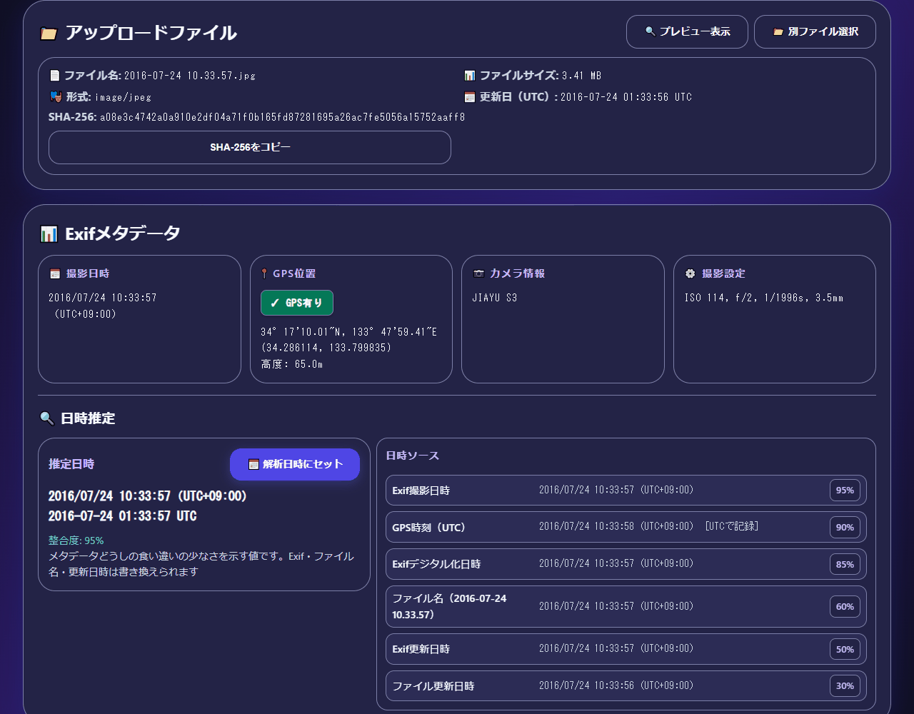
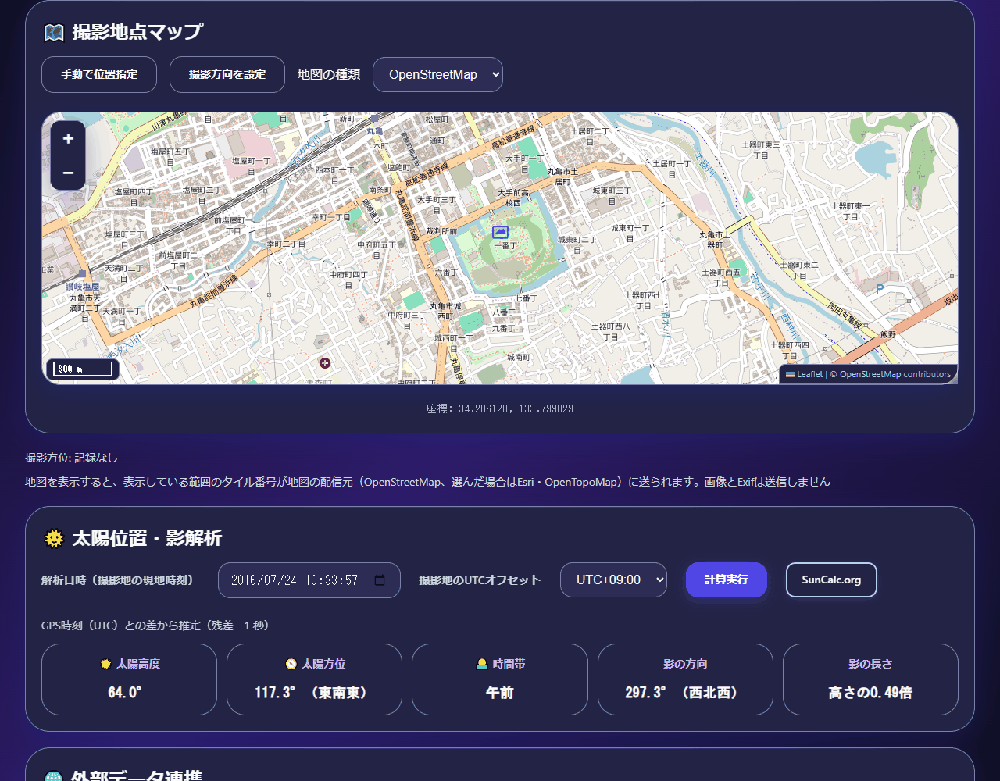
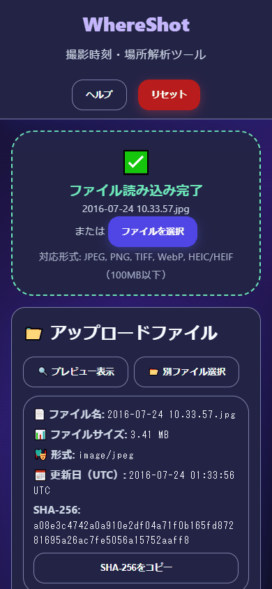

<!--
---
id: day013
slug: whereshot

title: "WhereShot"

subtitle_ja: "撮影時刻・場所解析ツール"
subtitle_en: "Capture Time & Place Analyzer"

description_ja: "画像から撮影時刻と場所を検証するOSINT支援ツール。ExifのUTCオフセット判定、太陽と影の計算、地図上の撮影方位、SHA-256と解析レポートに対応します。"
description_en: "An OSINT tool for verifying image capture time and location, with EXIF UTC offset inference, solar and shadow calculations, camera direction on maps, SHA-256 hashing, and analysis reports."

category_ja:
  - OSINT
  - フォレンジック
category_en:
  - OSINT
  - Forensics

difficulty: 3

tags:
  - EXIF
  - OSINT
  - geolocation
  - metadata
  - privacy
  - forensics
  - sun-position
  - leaflet
  - Metadata Analysis
  - Image Forensics

repo_url: "https://github.com/ipusiron/whereshot"
demo_url: "https://ipusiron.github.io/whereshot/"

hub: true
---
-->

# WhereShot - 撮影時刻・場所解析ツール


[](https://ipusiron.github.io/whereshot/)

**Day013 - 生成AIで作るセキュリティツール100**

WhereShotは、画像から「いつ・どこで撮られたか？」を推定・検証するためのOSINT支援ツールです。
Exifメタデータの抽出、太陽位置計算、地図上での方角可視化、気象データや衛星画像へのリンクを組み合わせます。
Exifがない画像も、日時と位置を手動で補って検討できます。

## 🌐 デモページ

👉 [WhereShotを開く](https://ipusiron.github.io/whereshot/)

## 📸 スクリーンショット


> *丸亀城のサンプル画像のExif、SHA-256、整合度95%の日時推定*


> *閲覧環境はAmerica/Los_Angeles。GPSからUTC+09:00を推定し、太陽高度64.0°を表示*


> *幅390pxでサンプル画像を読み込んだ画面*

## ✨ 機能

### 📊 メタデータ解析

- ExifReaderによる撮影日時、GPS座標、カメラ設定、レンズ情報の抽出
- UTCオフセットの根拠と日時ソースの整合度の表示
- ファイルのSHA-256と解析レポートのコピー

### 🗺️ 地理空間分析
- **インタラクティブマップ**: Leafletによる地図表示
- **マルチレイヤー対応**: OpenStreetMap, 衛星画像, 地形図の切り替え

### 🌞 天体位置計算
- **太陽位置算出**: 同梱したSunCalcによる計算
- **影解析**: 太陽高度・方位角から影の長さ・方向を予測
- **時刻検証**: 影の状況から撮影時刻の妥当性を検証

### 🧭 視覚的方位解析
- **撮影方向の可視化**: Exifに記録された撮影方位と、手動指定した方向の矢印表示

### 🌐 外部データ連携
自動リンク生成による効率的な情報収集ができます。

- **[NASA Worldview](https://worldview.earthdata.nasa.gov/)**: 衛星画像・気象データ
- **[地理院地図](https://maps.gsi.go.jp/)**: 空中写真・地形図
- [気象庁の過去の天気](https://www.data.jma.go.jp/stats/etrn/index.php)：最寄りの観測所の毎時データへのリンク

54か所の観測所から最寄りを選び、200km以内にない場合は気象庁のトップページへ案内します。日本国外のほか、小笠原・奄美・八丈島・大東島などは対象の観測所がありません。


## 📖 使い方

1. [デモページ](https://ipusiron.github.io/whereshot/)にアクセスするか、index.htmlを開く。
2. 画像をドラッグ&ドロップし、Exif情報と日時推定を確認する。
3. 撮影地のUTCオフセットと解析日時を確認し、必要なら変更する。
4. 地図上で撮影地点を確認する。GPSがなければ位置指定モードがONになるので地図をクリックする。
5. 太陽位置と影を確認し、外部リンクで撮影環境を調べる。
6. 必要に応じてSHA-256と解析結果をコピーする。

「手動で位置指定」と「撮影方向を設定」は同時には使いません。
どちらもOFFなら地図をクリックしても位置は変わりません。
プレビューはボタンで表示・非表示を切り替えられます。

### サンプル画像の解析例

[丸亀城のサンプル画像](assets/2016-07-24%2010.33.57.jpg)を読み込んだ結果です。

| 項目 | 値 |
|---|---|
| 撮影日時（現地） | 2016/07/24 10:33:57 |
| 撮影日時（UTC） | 2016-07-24 01:33:57 UTC |
| UTCオフセット | +09:00（GPS時刻との差、残差-1秒） |
| 太陽高度 | 64.0° |
| 太陽方位 | 117.3°（東南東） |
| 影の方向 | 297.3°（西北西） |
| 影の長さ | 高さの0.49倍 |
| 整合度 | 95% |
| 最寄りの観測所 | 高松（約23km） |
| SHA-256 | a08e3c4742a0a910e2df04a71f0b165fd87281695a26ac7fe5056a15752aaff8 |

## 🕒 時刻とタイムゾーンの扱い

Exifの撮影日時は撮影地の現地時刻で、DateTimeOriginal自体にはタイムゾーンがありません。
年月日時分秒の「壁時計」とUTCオフセットを組み合わせて、UTCの瞬間に変換します。
カメラの時計が撮影地の時刻に合っているとは限りません。旅行者のカメラなどは確認が必要です。

UTCオフセットは次の順で候補を選び、画面に根拠を表示します。

1. ExifのOffsetTimeOriginal
2. 現地時刻とGPS時刻（UTC）の差を15分単位に丸めた値（残差の絶対値が5分を超えたら使わない）
3. その日時のブラウザーのタイムゾーン（仮の値）

サンプルは現地10:33:57とGPSの01:33:58 UTCから、UTC+09:00、残差-1秒になります。
ExifのオフセットとGPSからの推定が食い違う場合は警告します。
オフセットは手動で変更でき、解析日時は秒まで保持します。
経度からの目安は表示するだけで、自動では適用しません。標準時や夏時間と一致しない場合があります。

## 🗂️ 対応形式とファイル名の形式

### 対応形式

| 形式 | MIME |
|---|---|
| JPEG | image/jpeg |
| PNG | image/png |
| TIFF | image/tiff |
| WebP | image/webp |
| HEIC/HEIF | image/heic、image/heif |

上限は100MBです。動画（MP4など）は対象外です。
HEIC/HEIFなどをブラウザーが表示できない場合も、プレビューを省いてメタデータの解析を続けます。
壊れた内容やExifがないファイルは、メタデータを読めなかった旨を通知します。

### ファイル名の形式

| 例 | 形式名 | 読み取る日時 | 基準 |
|---|---|---|---|
| IMG_20240101_123456.jpg | ymd-hms-compact | 2024/01/01 12:34:56 | 現地 |
| PXL_20240101_123456789.jpg | pxl-utc | 2024-01-01 12:34:56 UTC | UTC |
| Screenshot_2024-01-01-12-34-56.png | ymd-hms-sep | 2024/01/01 12:34:56 | 現地 |
| signal-2024-01-01-123456.jpg | ymd-sep-hms-compact | 2024/01/01 12:34:56 | 現地 |
| WhatsApp Image 2024-01-01 at 12.34.56.jpeg | ymd-hms-sep | 2024/01/01 12:34:56 | 現地 |
| 20160724103357.jpg | ymdhms-14 | 2016/07/24 10:33:57 | 現地 |
| 2024年1月1日12時34分56秒.jpg | ja-full | 2024/01/01 12:34:56 | 現地 |
| IMG-20240101-WA0001.jpg | ymd-8 | 2024/01/01 12:00:00 | 現地・日付のみ |
| 1609459200.jpg | unix-s | 2021-01-01 00:00:00 UTC | UTC |

強い形式から11種のパターンを試し、採用済みの文字範囲を二重に読み取りません。
日付だけの場合の12:00:00は仮の値で、撮影時刻ではありません。
無効な日付を翌月に繰り上げることはありません。

## 🎯 ユースケース

### OSINT調査・情報検証
- **SNS投稿の真偽判定**: 投稿画像の撮影時刻・場所の整合性確認
- **フェイクニュース検出**: 画像の再利用・転載元の特定
- **証拠資料の検証**: 法執行機関での画像証拠の信頼性評価

### 災害・事件対応
- **現地状況の確認**: 災害現場の画像から位置・時刻の手掛かりを確認
- **報道検証**: ニュース画像の撮影状況と報道内容の整合性確認
- **タイムライン構築**: 画像を1枚ずつ確認し、事件・災害の時系列を検討

### 教育・研修
- **OSINT技術の学習**: 実践的なオープンソースインテリジェンス訓練
- **情報リテラシー教育**: デジタル画像の真偽判定スキル向上
- **セキュリティ研修**: メタデータリスクの理解と対策

## 🔬 技術的な説明

| 要素 | 実装 |
|---|---|
| 画面 | vanilla JavaScript、HTML、CSS |
| Exif | ExifReader 4.12.0（自己ホスト） |
| 太陽位置 | SunCalc 1.9.0（自己ホスト） |
| 地図 | Leaflet 1.9.4（CDN＋SRI）、3種類のタイル |
| 純粋ロジック | js/whereshot-logic.js（DOM・タイムゾーン非依存） |
| 観測所 | stations.jsonと同じ54件をstations.jsで読み込む |

太陽の方位は真北を0°、時計回りにそろえ、16方位を日本語で表示します。
時間帯は高度と方位から決め、白夜・極夜にも対応します。
影の長さは物体の高さに対する比で、太陽が地平線の下なら影なしとします。
精度円はGPSHPositioningError（メートル）があるときだけ表示し、無次元のGPSDOPは使いません。
シャッター速度はExposureTimeを使います（例：0.000501秒は1/1996s）。

### 整合度

日時ソースの重みはExif撮影日時0.95、GPS時刻0.9、Exifデジタル化日時0.85、ファイル名0.4〜0.6、Exif更新日時0.5、ファイル更新日時0.3です。
時刻のあるソースを優先し、その中で重みの高いものを採用します。
更新日時2種を除くソースの組について、差が1時間（日付のみを含む場合は24時間）を超えると食い違いとします。

整合度＝round（採用ソースの重み×（0.5＋0.5×一致する組の割合）×100）÷100です。
比較する組がなければ一致割合は1、ソースがなければ整合度は0です。上限は95%です。
更新日時のずれは、保存・編集・コピーの可能性として注記します。
この値はメタデータどうしの食い違いの少なさであって、真実性の保証ではありません。

## 🔒 セキュリティとプライバシー

画像とExifの解析はブラウザー内で行い、画像・Exifを外部に送信しません。
入力した位置や解析結果、レポートをlocalStorageなどへ保存しません。
地図の表示には通信が必要で、撮影地点の周辺を見ていることがタイル配信元に伝わります。
機微な調査ではVPNなどの利用を検討してください。

### 通信先

| いつ | どこへ | 何が伝わるか |
|---|---|---|
| 起動時 | cdnjs.cloudflare.com | Leafletの2ファイルの取得（IPアドレスとオリジン） |
| 地図を表示・移動するたび | tile.openstreetmap.org | 表示範囲のタイル番号とオリジン |
| 衛星画像を選んだとき | server.arcgisonline.com | 表示範囲のタイル番号とオリジン |
| 地形図を選んだとき | *.tile.opentopomap.org | 表示範囲のタイル番号とオリジン |
| 外部リンクを押したときだけ | NASA・地理院・気象庁・Google・suncalc.org | URLに含まれる座標と日付（Google画像検索の入口には含まない） |

起動時には地図を作らず、画像を読み込むまでタイルは取得しません。
地図は選択中の1レイヤーだけを読み込みます。
OSMタイルのURLは`https://tile.openstreetmap.org/{z}/{x}/{y}.png`です。

対策として、'unsafe-inline'なしのCSP、LeafletのSRI、ExifReaderとSunCalcの自己ホストとハッシュ検証、textContentによる描画を使っています。
ファイル名やExif値をHTMLとして解釈せず、consoleに座標や日時を出しません。
外部リンクにはrel="noopener noreferrer"を付けます。
referrerはstrict-origin-when-cross-originです。OSMタイル利用規約が有効なRefererを求めるため、no-referrerにせず、HTTP配信時にはオリジンだけを送ります。
file://では有効なHTTPのRefererを送れないため、地図を利用する際はHTTP配信を勧めます。

### 地図タイルの出典とライセンス

- OpenStreetMap：© OpenStreetMap contributors、地図データはODbL、標準タイル利用規約に従う。
- OpenTopoMap：© OpenStreetMap contributors、SRTM、OpenTopoMap。地図はCC-BY-SAで提供される。
- Esri World Imagery：Esri Master License Agreementの下で提供される。帰属表示はEsri, Vantor, Earthstar Geographics, and the GIS User Community。

## ⚠️ 注意事項

本ツールはOSINT調査の支援を目的としており、プライバシー侵害や不正な監視活動での使用は意図されていません。適用される法律と倫理的ガイドラインを遵守してご利用ください。

Exif・ファイル名・更新日時は書き換えられます。この結果だけで撮影の事実を断定しないでください。
SNSに投稿された画像はExifが削除されていることが多く、位置や日時が得られない場合があります。
磁北基準の撮影方位は補正しません。真北基準の太陽方位やStreet Viewと比べる際は、この違いに注意してください。

## 🧪 テスト

Node 22以上で次を実行します。npm依存はありません。テスト中のネットワークアクセスも不要です。

```bash
npm test
```

GitHub Actionsがpushとpull_requestで自動実行します。
READMEの表と例、配色、HTML、配布ライブラリーのサイズとSHA-256も検証します。
子プロセスをUTC・Asia/Tokyo・America/Los_Angeles・Pacific/Kiritimatiで起動し、日時推定・太陽位置・リンク・レポートが完全に一致することを確認します。

## 🧭 今後の候補

以下は未実装です。

- 座標系変換（UTM・JGD2011）
- 季節判定、視野角計算、ランドマーク照合
- 磁気偏角の補正
- バッチ処理、CSV出力、比較分析

## 🔗 参考

- [ExifReader](https://github.com/mattiasw/ExifReader)
- [SunCalc](https://github.com/mourner/suncalc)
- [SunCalc.org](https://www.suncalc.org/)
- [Leaflet](https://leafletjs.com/)
- [Google Maps URLs](https://developers.google.com/maps/documentation/urls/guide)
- [OSMタイル利用規約](https://operations.osmfoundation.org/policies/tiles/)
- [OpenStreetMapの著作権とライセンス](https://www.openstreetmap.org/copyright)
- [OpenTopoMapについて](https://opentopomap.org/about)
- [Esri World Imagery](https://www.arcgis.com/home/item.html?id=10df2279f9684e4a9f6a7f08febac2a9)

## 📁 ディレクトリー構造

```text
whereshot/
├── index.html                       # 画面とCSP
├── css/style.css                    # 不透明なダーク配色とレスポンシブ表示
├── js/
│   ├── whereshot-logic.js            # 環境非依存の計算と書式
│   ├── utils.js                      # File・UIの補助
│   ├── exif-parser.js                # FileとExifReaderの接続
│   ├── sun-calculator.js             # SunCalcの接続
│   ├── map-controller.js             # Leafletと地図操作
│   └── main.js                       # 画面の制御
├── assets/                           # サンプル画像とスクリーンショット
├── data/
│   ├── stations.json                 # 54か所の観測所の正本
│   └── stations.js                   # file://対応の同一データ
├── vendor/
│   ├── exifreader/                   # ExifReader本体、LICENSE、README
│   └── suncalc/                      # SunCalc本体、LICENSE、README
├── docs/
│   ├── user_guide.md                 # 使用方法ガイド
│   └── api_reference.md              # 内部API仕様
├── test/                             # Node標準テストとフィクスチャ
├── .github/workflows/test.yml         # 自動テスト
├── package.json                      # npm testの定義
├── .nojekyll                         # Pagesで静的ファイルをそのまま配信
├── CLAUDE.md                         # 開発規則
├── LICENSE                           # MITライセンス
└── README.md                         # 本ファイル
```

## 💻 動作環境

現行のChrome・Edge・Firefox・Safariを想定しています。File.arrayBuffer、Web Crypto、dialogを使います。
HEICのプレビュー可否はブラウザーに依存します。
index.htmlを直接開くfile://でも解析できます。観測所はHTTPと同じ54件です。
HTTPで配信する場合はリポジトリーのルートで次を実行し、http://localhost:8000を開きます。

```bash
python -m http.server 8000
```

テストにはNode 22以上が必要です。ビルド処理はありません。

## 📄 ライセンス

ツール本体はMIT Licenseです。[LICENSE](LICENSE)を参照してください。
同梱のExifReader 4.12.0はMPL-2.0、SunCalc 1.9.0はBSD-2-Clauseです。
それぞれvendor/にLICENSEと入手元・ハッシュのREADMEを同梱しています。
地図データ・タイルには配信元のライセンスと利用規約が適用されます。

## 🛠 このツールについて

本ツールは、「生成AIで作るセキュリティツール100」プロジェクトの一環として開発されました。 このプロジェクトでは、AIの支援を活用しながら、セキュリティに関連するさまざまなツールを100日間にわたり制作・公開していく取り組みを行っています。

プロジェクトの詳細や他のツールについては、以下のページをご覧ください。

🔗 [https://akademeia.info/?page_id=42163](https://akademeia.info/?page_id=42163)
